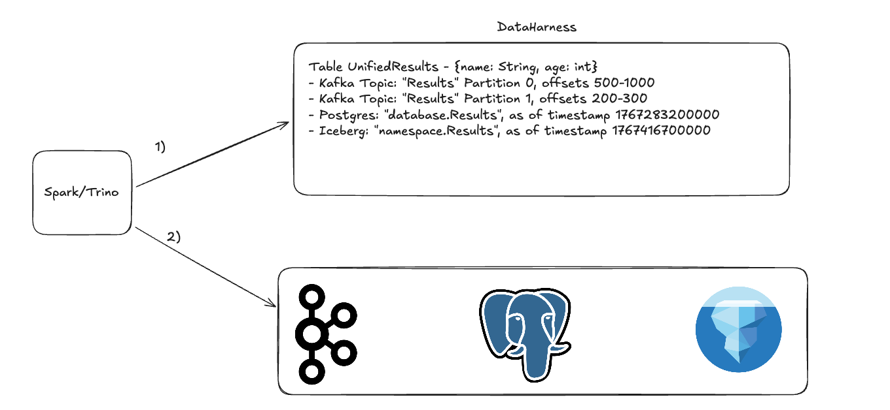

# DataHarness Repository

## Project Overview

In the past few years, we've seen the proliferation of new table formats for analyzing big data. While these
work well enough for many analytical workloads, the role of the lake-house keeps expanding, and more development
work goes into making "hybrid" solutions.

Examples:

- Hybrid kafka/iceberg topics (RedPanda, Streambased, Confluent)
- Various delete semantics in lakehouses (positional/equality/deletion vectors)
- Mixing lakehouses with transactional databases (Mooncake/Crunchy Data)
- Proprietary "HTAP" solutions for hybrid processing (DataBricks, Snowflake)
- Streaming connectors between kafka and iceberg for exactly once processing (Kafka Connect, Flink)

**DataHarness** aims to remove the need for the proprietary technology to fuse data sources,
and let teams bring their own data sources. This should allow you to use the technology best
suited towards your pipeline.

## Key Intentions

- **Unified Access**: One DataHarness table can contain data from many different sources
- **Simplified Insertion**: Single metadata store ensures that you never see data across sources in an inconsistent
  state, eliminating the need to use Flink/Kafka Connect for simple pipelines
- **Multi-Source Support**: Seamlessly integrate Kafka topics, relational databases, data lakes, and more
- **Multi-Query Engine Support**: Currently developing for Spark and Trino, with plans to expand

The DataHarness is simply a powerful building-block for fusing many data systems together into a single table.
It allows

- Atomic schema updates
- Transactional data movement between sources

Developers can use the DataHarness to build out complete HTAP solutions and improve upon existing "object-store-only"
based table formats.

## Reading From The Data Harness

When reading a data harness table, the query engine first consults the data harness to figure out the state to pull from
each data source. Having a single source of truth for table source offsets/read version ensures that we can move data
between our sources and still see the table in a consistent state. Now,
we can see table data the moment it is published to kafka, achieve fast
"upserts" in Postgres, and store cold data in Iceberg!



## Simple Data Pipelines For Data Harness Tables

Many data pipelines, especially with Apache Iceberg, rely on using something like
Kafka Connect or Apache Flink for achieving exactly once semantics. Having a stream-consumer agnostic
state store allows developers to avoid the need to use complicated frameworks for simple pipelines. On a consumer
failure, use the DataHarness to determine which offsets to recover from.


## What Can Be A Data Source?

For a data system to work as a "source" for a harness table, it must only satisfy one constraint:

- It must be able to provide an API to see state at a prior period of time

Examples:

- In Kafka, you can specify offsets to read between and get the same data back, regardless of if there are new messages
- In Iceberg/YugabyteDB, you can specify a read timestamp to see historic state of a table

What does this mean?

- In their vanilla state, we cannot support MySQL and PostgresSQL as first class citizens of DataHarness
- However, we can support MySQL and PostgresSQL wire-protocol compliant databases like TiDB and YugabyteDB or use
  MySQL/Postgres extensions!

## Creating A DataHarness Table

This example displays how to create a data harness table which contains data from a topic partition
with avro-encoded data, an iceberg table, and a YugabyteDB table. The DataHarness is running on
localhost:50051.

```
      ManagedChannel channel = ManagedChannelBuilder.forAddress("localhost", 50051).usePlaintext().build();
      CatalogServiceGrpc.CatalogServiceBlockingStub stub = CatalogServiceGrpc.newBlockingStub(channel);

      CreateTableRequest createTableRequest = CreateTableRequest.newBuilder()
        .setName(DATA_HARNESS_TABLE)
        .build();

      stub.createTable(createTableRequest);

      KafkaSourceMessage kafkaSource = KafkaSourceMessage.newBuilder()
        .setTrinoCatalogName("kafka")
        .setTrinoSchemaName("default")
        .setTopicName(TOPIC)
        .setStartOffset(0)
        .setEndOffset(kafkaResult.messageCount)
        .setPartitionNumber(0)
        .setBrokerUrls(BOOTSTRAP_SERVERS)
        .setSchemaType(SchemaType.AVRO)
        .setSchema(kafkaResult.avroSchema)
        .build();

      SourceUpdate kafkaSourceUpdate = SourceUpdate.newBuilder()
        .setTableName(DATA_HARNESS_TABLE)
        .setKafkaSource(kafkaSource)
        .build();

      UpsertSourcesRequest.Builder upsertSourcesBuilder = UpsertSourcesRequest.newBuilder()
        .addSources(kafkaSourceUpdate);

      IcebergSourceMessage icebergSource = IcebergSourceMessage.newBuilder()
        .setTrinoCatalogName("iceberg")
        .setTrinoSchemaName("default")
        .setTableName(ICEBERG_TABLE_NAME)
        .setReadTimestamp(icebergResult.snapshotId)
        .setSparkCatalogName("gravitino")
        .setSparkSchemaName("default")
        .build();

      SourceUpdate icebergSourceUpdate = SourceUpdate.newBuilder()
        .setTableName(DATA_HARNESS_TABLE)
        .setIcebergSource(icebergSource)
        .build();

      upsertSourcesBuilder.addSources(icebergSourceUpdate);

      YugabyteDBSourceMessage yugabyteSource = YugabyteDBSourceMessage.newBuilder()
        .setTrinoCatalogName(NOT_IMPLEMENTED)
        .setTrinoSchemaName(NOT_IMPLEMENTED)
        .setTableName(YUGABYTE_TABLE_NAME)
        .setJdbcUrl(YUGABYTE_JDBC_URL)
        .setUsername(YUGABYTE_USER)
        .setPassword(YUGABYTE_PASSWORD)
        .setReadTimestamp(yugabyteTimestamp)
        .build();

      SourceUpdate yugabyteSourceUpdate = SourceUpdate.newBuilder()
        .setTableName(DATA_HARNESS_TABLE)
        .setYugabytedbSource(yugabyteSource)
        .build();

      upsertSourcesBuilder.addSources(yugabyteSourceUpdate);

      stub.upsertSources(upsertSourcesBuilder.build());

      ProtobufSchema protobufSchemaObj = new ProtobufSchema(io.github.jordepic.test.TestMessage.getDescriptor());
      String protobufSchema = protobufSchemaObj.canonicalString();

      SetSchemaRequest.Builder schemaRequestBuilder = SetSchemaRequest.newBuilder()
        .setTableName(DATA_HARNESS_TABLE)
        .setAvroSchema(kafkaResult.avroSchema)
        .setProtobufSchema(protobufSchema);

      schemaRequestBuilder.setIcebergSchema(icebergResult.icebergSchema);

      SetSchemaRequest schemaRequest = schemaRequestBuilder.build();

      stub.setSchema(schemaRequest);
```

## Currently Supported

|                                                              | Apache Spark | Apache Trino |
|--------------------------------------------------------------|--------------|--------------|
| Kafka with Avro Encoded Data (Confluent Schema Registry)     | ✅            | ✅            |
| Kafka with Protobuf Encoded Data (Confluent Schema Registry) |              | ✅            |
| Pulsar with Avro Encoded Data                                |              |              |
| Pulsar with Protobuf Encoded Data                            |              |              |
| Amazon Kinesis with Avro Encoded Data                        |              |              |
| Amazon Kinesis with Protobuf Encoded Data                    |              |              |
| Azure Event Hubs with Avro Encoded Data                      |              |              |
| Azure Event Hubs with Protobuf Encoded Data                  |              |              |
| PostgreSQL (Temporal Tables Extension)                       | ✅            | ✅            |
| YugaByteDB (Postgres compatible)                             | ✅            |              |
| YugaByteDB (Cassandra compatible)                            |              |              |
| CockroachDB (Postgres compatible)                            |              |              |
| TiDB (MySQL compatible)                                      |              |              |
| CockroachDB (Postgres compatible)                            |              |              |
| Google Spanner                                               |              |              |
| Apache Iceberg                                               | ✅            | ✅            |
| Apache Hudi                                                  |              |              |
| Delta Lake                                                   |              |              |
| Duck Lake                                                    |              |              |
| Avro Files                                                   |              |              |
| Parquet Files                                                |              |              |
| Orc Files                                                    |              |              |

Main supported features:

- Transfer data between data sources and atomically update their state in the DataHarness
- Perform a rolling update of schemas and then atomically update the table schema in the DataHarness
- Specify the table's schema in terms of Avro schema, Iceberg schema, or Protocol Buffers schema

Two main features that are not currently supported but we hope to support soon:

- Primary key tables (right now the data from each table source is unioned together)
- Schema evolutions are currently atomic, though tables may temporarily break due to modifying inner fields of complex
  types

## Reading Data Harness Tables From Apache Spark

This repository exposes a spark catalog that you can set up very easily. To do so, create your spark program as follows:

```bash
./bin/spark-sql --packages io.github.jordepic:dataharness-spark:1.0
--conf spark.sql.catalog.harness=io.github.jordepic.spark.DataHarnessCatalog
--conf spark.sql.extensions=io.github.jordepic.spark.DataHarnessExtension
--conf spark.sql.catalog.harness.data-harness-host=data-harness
--conf spark.sql.catalog.harness.data-harness-port=50051
```

This creates a DataHarness catalog called `harness`. To query it, you can run:
`SELECT * FROM harness.data_harness.<table_name>;` -> Note that `data_harness` is currently the only supported namespace

While the above configuration allows using the DataHarness catalog, it does not import any dependencies that might
be needed to read:

- Avro data
- Protobuf data
- Iceberg data
- And so on...

You can
see [our integration test docker compose file](./dataharness-server/src/test/java/io/github/jordepic/bootstrap/docker-compose.yaml)
for an example of us running with an iceberg catalog, a YugabyteDB table, and a kafka topic with avro-encoded data.

NOTE:

- For iceberg tables, the "spark catalog" and "spark namespace" should be equal to the name of the catalog in spark and
  its namespace
- For kafka topic partitions, spark needs to know the broker URLs for each source, there is no "kafka catalog"
    - It needs to know the schema as well, there is no schema registry support for the time being
- For JDBC tables, the jdbc url, username, password, etc... will all need to be specified in the source

## Reading Data Harness Tables From Apache Trino

For Trino, setting up the Data Harness is fairly simple!

1. Set up all data sources like you normally would (e.g. configure kafka catalog, postgres catalog, iceberg catalog
   individually)
2. Add a "data harness" catalog
    - Since this is a custom plugin, you should follow the directions to install them from
      the [trino docs](https://trino.io/docs/current/installation/plugins.html#installation)
    - We have an example of extracting the zip file and putting it in the trino docker
      image [here](dataharness-server/src/test/java/io/github/jordepic/bootstrap/Dockerfile.trino)
3. In each of your table "sources", be sure to set the appropriate Trino catalog name and schema name that you used for
   your catalogs in step 1

Configure your Trino DataHarness source!

```
connector.name=data_harness
data-harness.host=host.docker.internal
data-harness.port=50051
```

Note: If you are planning on using PostgreSQL as a data source, please read [the postgres setup section](#setting-up-postgresql-sources).

## Setting Up PostgreSQL Sources

By default, PostgreSQL does not support time travel reads. However, there are extensions that enable this functionality.

The DataHarness project currently supports Postgres databases that use one of the two following extensions:

- [Temporal Tables](https://github.com/arkhipov/temporal_tables)
- [Temporal Tables (PgSQL Based)](https://github.com/nearform/temporal_tables)

These extensions allow creating a second table for data auditing that allows us to perform time travel reads.

1) The audit table should have all of the same data columns as the main table
    - It can be indexed in any way you see fit (all of our queries to this table are inherently timestamp column based)
2) These plugins use the tstzrange column to establish a timestamp bound for the validity of each row
    - The Trino Postgres plugin does not support these
    - To work in Trino, you must create a view for the "current" table and "audit" (or history) table which extracts the
      range column to two simple timestamp columns called `tsstart` and `tsend`
        - You can see an example of how to do this
          in [DataPopulatorIntegrationTest](dataharness-server/src/test/java/io/github/jordepic/bootstrap/DataPopulatorIntegrationTest.java)

## Why Not Mooncake?

You can read more about [Mooncake here.](https://www.mooncake.dev/whitepaper)

Mooncake is a project that seamlessly integrates PostgreSQL and Iceberg.

Internally it allows:

1) Converting postgres data into queryable in-memory arrow buffers and occasionally committing them to iceberg
    - This allows minimizing the number of commits to iceberg
    - These are more optimized for analytical workloads
    - Mooncake keeps an optimized in-memory index of row to iceberg file for faster upserts with positional
      deletes/deletion vectors
2) Querying the arrow buffers from an embedded duckdb instance within Postgres
    - That data is then combined with the flushed iceberg files

This approach significantly speeds up the rate at which data is ready to be analyzed.

In my opinion, it offers two main drawbacks:

1) You must use the same Postgres instance to query the arrow buffers, as opposed to being able to include them in
   distributed queries
2) Mooncake development is currently heavily biased towards postgres and iceberg (though they claim this is prone to
   change)
    - This could result into lock in into the iceberg table format for analytics as opposed to another one
    - You could make the argument that data harness currently only supports iceberg (though it's trivial to extend)

With DataHarness, your data is accessible from the vast majority of popular query engines, and you don't lose the
ability
to perform distributed queries across your OLTP and OLAP data while still getting better data freshness.

In the future, I hope that there is room for DataHarness and Mooncake to work together.

1) Mooncake still performs CDC from a postgres table into arrow buffers in-memory on an arrow flight server
2) The arrow flight server is a DataHarness source
    - Spark can already [read flight data](https://github.com/qwshen/spark-flight-connector?tab=readme-ov-file), so can
      Presto [can too](https://prestodb.io/docs/current/connector/base-arrow-flight.html)

DataHarness is not opinionated on the CDC framework that you use. It is simply a primitive to build correct and complex
distributed tables.

## Contributing Guide

This project uses this MIT license.

Go ahead and file a PR! Since this is such a small project for now, I'll individually review them all.

If the project gains popularity, I'll establish a more formal committee.

## Deploying

For very simple docker images/helm charts, see [docker hub](https://hub.docker.com/r/jordepic/data-harness/tags).

## Distributed Locking

If using multiple processes to modify a DataHarness table's sources, we could encounter scenarios where they
result in non-sensical updates.

Example:

- Process 1 reads from kafka topic partition 1 and adds data to iceberg table x
- Process 2 reads from kafka topic partition 2 and adds data to iceberg table x

Let's imagine process 1 puts data in the iceberg table first, resulting in an iceberg snapshot A.
Then process 2 puts data in an iceberg table next, resulting in an iceberg snapshot of B (after A).

However, process 2 commits to the data harness before process 1, resulting in Spark reading the iceberg table as of
snapshot A. Then, we'll decline to show the data from process 2 that was in kafka and is now in iceberg, since we've
updated
our kafka topic partition 2 offsets to reflect the fact that we've processed this data.

To solve this problem, we can use the DataHarness as a lock.

1) Process 1 claims kafka partition 1 and iceberg table x
2) Process 2 tries to claim kafka partition 2 and iceberg table x and fails because x is claimed
    - As a result, it does not exchange any messages between kafka and iceberg
3) Process 1 finishes processing both kafka partition 1 and iceberg table x, and updates the offsets in the DataHarness,
   which releases its claims
4) Process 2 retries claiming kafka partition 2 and iceberg table x and succeeds
5) Process 2 exchanges messages between kafka partition 2 and iceberg table x, and updates the offsets in the
   DataHarness, which releases its claims

Is it so bad to have a distributed lock? These are all relatively infrequent metadata transactions which should be
taking <1s at a time.

Oh, but I wanted to have Iceberg data visible faster than that!

- That's the point of the data harness: rather than committing that data to iceberg,
  you can instead buffer it in a row store and query from there

Oh, but I wanted to have many processes committing to my OLTP database at once!

- So use many tables/partitions. That's how you avoid write conflicts in distributed systems
- The DataHarness will union them for you and ensure atomic schema evolutions
